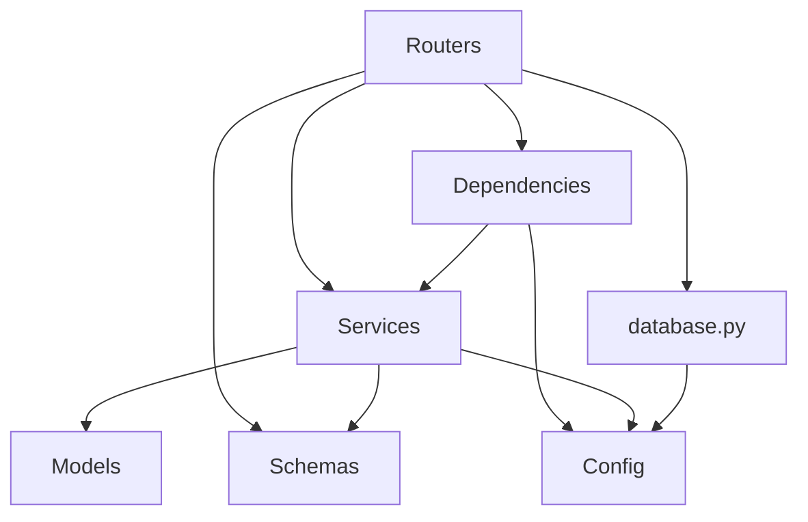

# Architecture Overview

## Layered Architecture

```
Routers (HTTP layer)
    ↓ calls
Services (Business logic)
    ↓ uses
Models (SQLModel tables) + Schemas (Pydantic DTOs)
    ↓ persists via
Database (async SQLAlchemy sessions)
```

### Layer Responsibilities

| Layer | Responsibility | May Import |
|-------|---------------|------------|
| **Routers** | Parse HTTP request, call service, format response | Services, Schemas, Dependencies |
| **Services** | Business rules, validation orchestration, transactions | Models, Schemas, other Services |
| **Models** | Table definitions, column constraints | Nothing (leaf) |
| **Schemas** | Request/response shapes, field validation | Nothing (leaf) |
| **Dependencies** | Auth guards, session injection | Services, Config |
| **Config** | Environment variable management | Nothing (leaf) |

### Rules

1. **No layer skipping** — Routers must not import Models directly for DB operations
2. **Services are framework-agnostic** — No `Request`, `Response`, or `HTTPException` in services
3. **Models have no methods** — Pure data containers (SQLModel tables)
4. **Schemas validate** — All constraints (min_length, regex, etc.) belong in schemas

## Directory Structure

```
backend/
├── app/
│   ├── __init__.py
│   ├── main.py              # App factory, lifespan, middleware, routers
│   ├── config.py             # Settings singleton (pydantic-settings)
│   ├── database.py           # Engine, session factory, get_session
│   ├── dependencies.py       # Depends() callables (auth, session)
│   ├── models/               # One file per aggregate
│   │   ├── __init__.py       # Re-export ALL models
│   │   ├── post.py           # Post, PostLike
│   │   ├── comment.py
│   │   ├── article.py
│   │   └── inquiry.py
│   ├── schemas/              # One file per domain
│   │   ├── __init__.py       # Re-export ALL schemas
│   │   ├── post.py
│   │   ├── comment.py
│   │   └── ...
│   ├── services/             # Business logic modules
│   │   ├── __init__.py       # Re-export public API
│   │   ├── post_service.py
│   │   ├── auth.py
│   │   ├── spam.py
│   │   └── ...
│   └── routers/              # One file per API group
│       ├── __init__.py
│       ├── posts.py
│       └── ...
├── tests/
│   ├── conftest.py           # Shared fixtures
│   ├── test_posts.py
│   └── ...
├── requirements.txt
├── mypy.ini
└── Dockerfile
```

## Dependency Flow



## Module Scope Rules

| Module | Max Lines | When to Split |
|--------|-----------|---------------|
| Router | ~200 | Split by sub-resource (e.g., post likes → separate router) |
| Service | ~300 | Split by domain concept |
| Schema | ~150 | Split when >10 models in a file |
| Model | ~100 | One file per DB table aggregate |
