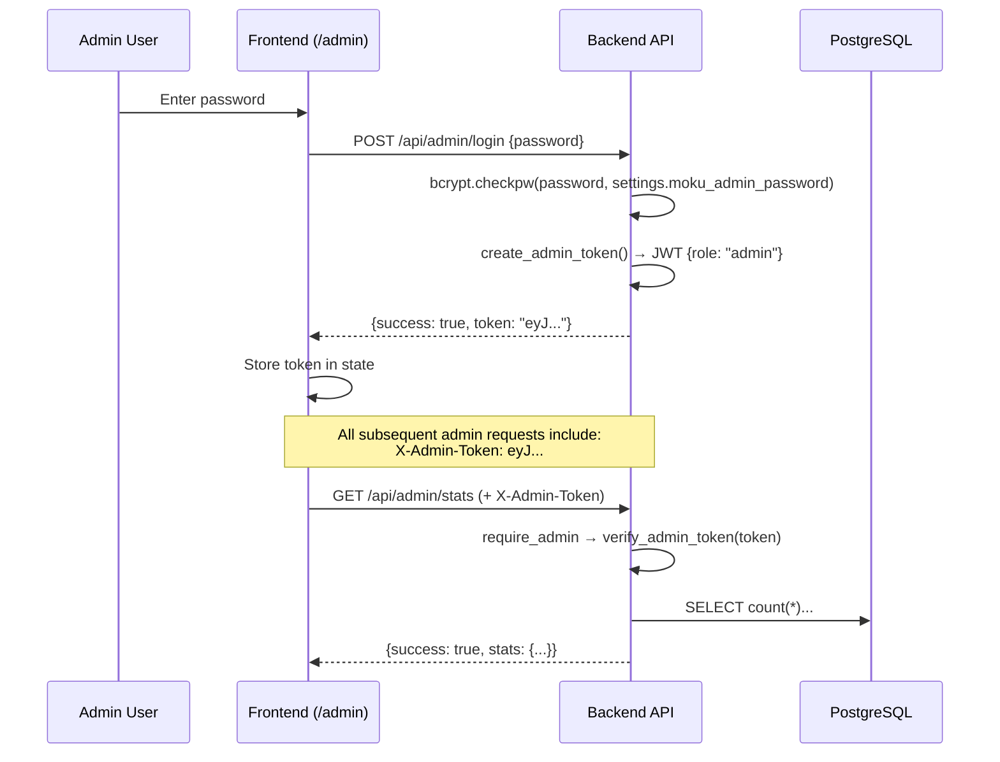
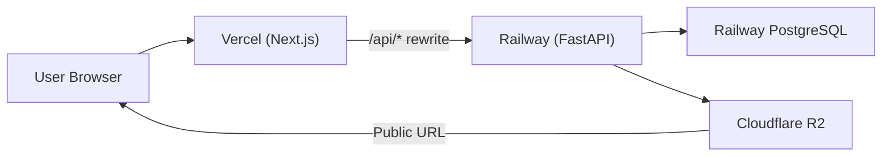

# Moku Archive — Site Flow & Architecture Reference

**Last Updated:** 2026-03-10

A comprehensive reference for understanding the Moku Archive full-stack application — a Korean H-1 Working Holiday agency website with community, archive, and consultation features.

---

## 1. Tech Stack Overview

| Layer | Technology | Hosting |
|-------|-----------|---------|
| Frontend | Next.js 15 (App Router), React, TypeScript | Vercel |
| Styling | Vanilla CSS + shadcn/ui (Radix primitives) | — |
| Backend | FastAPI, SQLModel, async SQLAlchemy, Pydantic v2 | Railway (Docker) |
| Database | PostgreSQL (asyncpg driver) | Railway |
| Storage | Cloudflare R2 (S3-compatible, aioboto3) | Cloudflare |
| Migrations | Alembic (auto-run on startup) | — |
| i18n | i18next (ja / ko / en) | — |
| Auth | JWT (admin only, `X-Admin-Token` header) | — |
| Analytics | Google Analytics (G-M0EESK8HQK) | — |

---

## 2. Monorepo Structure

```
mokuarchive/
├── frontend/                  # Next.js 15 (App Router)
│   ├── src/
│   │   ├── app/               # Route pages (file-based routing)
│   │   ├── components/        # React components
│   │   ├── i18n/              # i18next config + locales (ja/ko/en)
│   │   ├── lib/               # API client, utils
│   │   ├── styles/            # globals.css
│   │   └── types/             # TypeScript type definitions
│   ├── next.config.ts
│   └── package.json
├── backend/                   # FastAPI
│   ├── app/
│   │   ├── main.py            # App entry, lifespan, Sentry init
│   │   ├── config.py          # pydantic-settings (env management)
│   │   ├── database.py        # Async engine + session factory (URL sanitization)
│   │   ├── dependencies.py    # FastAPI Depends (admin guards)
│   │   ├── sentry.py          # Sentry SDK init, event filtering, helpers
│   │   ├── middleware/        # CacheHeaderMiddleware (Cache-Control by route)
│   │   ├── models/            # SQLModel table definitions (+ TokenBlacklist)
│   │   ├── schemas/           # Pydantic request/response models (CamelModel base)
│   │   ├── services/          # Business logic + cache + exceptions + storage
│   │   └── routers/           # HTTP layer (route handlers)
│   ├── alembic/               # Alembic migrations
│   │   ├── env.py             # Dynamic DB URL from settings
│   │   └── versions/          # Migration scripts
│   ├── alembic.ini
│   ├── requirements.txt
│   ├── requirements-dev.txt
│   └── Dockerfile
└── .agents/skills/            # Agent skill files
```

---

## 3. Frontend Pages & Routes

### Public Pages

| Route | Page Component | Rendering | Description |
|-------|---------------|-----------|-------------|
| `/` | `page.tsx` → Hero, VisaProcess, ArchiveListPreview, FAQ, InquiryForm | SSG + ISR (1h) | Landing page with all main sections |
| `/archive` | `ArchiveListPage` | SSG + ISR (5min) | Article list from backend API |
| `/archive/[id]` | `ArchiveArticle` | SSG + ISR (5min) | Article detail with JSON-LD structured data |
| `/community` | `CommunityPage` (client) | CSR | Community board with posts, comments, likes |
| `/guideline` | `GuidelinePage` | SSG | H-1 visa guideline info |
| `/partners` | `PartnersPage` | SSG + ISR (1d) | Partner companies showcase |
| `/privacy` | `PrivacyPage` | SSG | Privacy policy |
| `/terms` | `TermsPage` | SSG | Terms of service |
| `/tokushoho` | `TokushohoPage` | SSG | 特定商取引法 (Japanese law page) |

### Admin Page

| Route | Component | Rendering | Description |
|-------|-----------|-----------|-------------|
| `/admin` | `AdminPage` (client) | CSR | JWT login → Dashboard (Stats, Inquiries, Community, Archive tabs) |

### Special Pages

| Route | Description |
|-------|-------------|
| `/not-found.tsx` | Custom 404 page |
| `/robots.ts` | SEO robots.txt generation |
| `/sitemap.ts` | SEO sitemap generation |

---

## 4. Landing Page Scroll Flow (`/`)

The homepage is a single-page scroll with section-based navigation via `SideNav` (floating bottom dots on desktop):

```
┌──────────────────────────────────────┐
│  Header (fixed, transparent → white) │
├──────────────────────────────────────┤
│  Hero Section                        │
│  (Full-screen bg image, CTA button)  │
├──────────────────────────────────────┤
│  #visa-process — VisaProcess         │
│  (Step-by-step visa guide)           │
├──────────────────────────────────────┤
│  #archive — ArchiveListPreview       │
│  (Latest 4 articles from API)        │
├──────────────────────────────────────┤
│  #faq — FAQ                          │
│  (Accordion Q&A)                     │
├──────────────────────────────────────┤
│  #inquiry — InquiryForm              │
│  (Consultation request form)         │
├──────────────────────────────────────┤
│  Footer                              │
└──────────────────────────────────────┘
     [SideNav: floating dot navigation]
     [ScrollToTop: bottom-right button]
```

---

## 5. Layout Structure

`layout.tsx` wraps all pages with:

```
<html lang="ja">
  <body>
    <GoogleAnalytics />
    <I18nProvider>
      <ErrorBoundary>
        <NetworkStatus />       ← offline/online toast
        <Header />              ← fixed nav (MOKU logo, Archive, Community, Partners, Guideline, Consultation CTA)
        <main>{children}</main>
        <Footer />
        <CookieConsent />       ← GDPR cookie banner
      </ErrorBoundary>
    </I18nProvider>
    <Toaster />                 ← toast notifications (sonner)
  </body>
</html>
```

**Header Navigation Links:**
- Archive → `/archive`
- Community → `/community`
- Partners → `/partners`
- Guideline → `/guideline`
- Consultation (CTA Button) → `/#inquiry`

**Fonts:** Noto Sans JP, Noto Sans KR, M PLUS 1p

---

## 6. Backend API Endpoints

### Posts (`/api/posts`)

| Method | Path | Auth | Rate Limit | Description |
|--------|------|------|-----------|-------------|
| GET | `/api/posts` | — | 30/min | List posts (paginated, searchable, filterable, sortable) |
| POST | `/api/posts` | — | 5/min | Create post (anonymous, password-protected) |
| PUT | `/api/posts/{id}` | — | 10/min | Update post (password required) |
| DELETE | `/api/posts/{id}` | — / Admin | 10/min | Delete post (password or admin token) |
| POST | `/api/posts/{id}/view` | — | 60/min | Increment view count |
| POST | `/api/posts/{id}/like` | — | 30/min | Toggle like (visitor_id based) |
| GET | `/api/posts/{id}/likes` | — | 60/min | Get like status |
| POST | `/api/posts/likes/bulk` | — | 30/min | Batch like counts |
| POST | `/api/posts/{id}/verify-password` | — | 10/min | Verify post password |
| POST | `/api/posts/{id}/pin` | Admin | 10/min | Toggle pin status |
| GET | `/api/posts/{id}/comments` | — | 30/min | List comments for post |
| POST | `/api/posts/{id}/comments` | — | 5/min | Create comment |

### Comments (`/api/comments`)

| Method | Path | Auth | Rate Limit | Description |
|--------|------|------|-----------|-------------|
| PUT | `/api/comments/{id}` | — | 10/min | Edit comment (password required) |
| DELETE | `/api/comments/{id}` | — / Admin | 10/min | Delete comment (password or admin) |
| POST | `/api/comments/{id}/verify-password` | — | 10/min | Verify comment password |

### Articles (`/api/articles`)

| Method | Path | Auth | Rate Limit | Description |
|--------|------|------|-----------|-------------|
| GET | `/api/articles` | — | 30/min | List all articles |
| GET | `/api/articles/{id}` | — | 60/min | Article detail |
| POST | `/api/articles` | Admin | 10/min | Create article (slug-based ID) |
| PUT | `/api/articles/{id}` | Admin | 10/min | Update article (partial merge) |
| DELETE | `/api/articles/{id}` | Admin | 10/min | Delete article + cleanup R2 storage |

### Inquiries (`/api/inquiries`)

| Method | Path | Auth | Rate Limit | Description |
|--------|------|------|-----------|-------------|
| POST | `/api/inquiries` | — | 3/min | Submit consultation request (public) |
| GET | `/api/inquiries` | Admin | 30/min | List all inquiries |
| PUT | `/api/inquiries/{id}/status` | Admin | 10/min | Update status + admin_note |
| DELETE | `/api/inquiries/{id}` | Admin | 10/min | Delete inquiry |

### Admin (`/api/admin`)

| Method | Path | Auth | Rate Limit | Description |
|--------|------|------|-----------|-------------|
| POST | `/api/admin/login` | — | 5/min | Login → JWT token |
| GET | `/api/admin/stats` | Admin | 30/min | Dashboard statistics |
| POST | `/api/admin/upload-image` | Admin | 10/min | Upload image to R2 (5MB limit) |
| POST | `/api/admin/delete-image` | Admin | 10/min | Delete image from R2 |

### Config & Health

| Method | Path | Description |
|--------|------|-------------|
| GET | `/api/config` | GA measurement ID + verification codes |
| GET | `/api/health` | Liveness probe (`{"status": "ok"}`) |
| GET | `/api/ready` | Readiness probe (checks DB connectivity) |

---

## 7. Data Models (DB Tables)

### posts
| Column | Type | Notes |
|--------|------|-------|
| id | Text (PK) | UUID-based |
| numeric_id | BigInteger | Auto-incrementing display ID |
| title | Text | |
| author | Text | Anonymous nickname |
| content | Text | Post body |
| password | Text | bcrypt hashed |
| views | Integer | Default 0 |
| comment_count | Integer | Denormalized counter |
| pinned | Boolean | Admin-toggled |
| pinned_at | DateTime? | |
| experience | VARCHAR? | `experienced` / `inexperienced` |
| category | VARCHAR? | `question` / `info` / `chat` |
| created_at | DateTime | UTC |
| updated_at | DateTime | UTC |

### post_likes
| Column | Type | Notes |
|--------|------|-------|
| id | UUID (PK) | |
| post_id | Text (FK → posts.id) | |
| visitor_id | VARCHAR | Browser-generated visitor ID |
| created_at | DateTime | |

### comments
| Column | Type | Notes |
|--------|------|-------|
| id | Text (PK) | |
| post_id | Text (FK → posts.id) | |
| parent_id | Text? (FK → comments.id) | Self-referential for nested replies |
| author | Text | |
| content | Text | |
| password | Text | bcrypt hashed |
| created_at | DateTime | |
| updated_at | DateTime | |

### articles
| Column | Type | Notes |
|--------|------|-------|
| id | Text (PK) | Slug-based (e.g. `visa-guide-2026`) |
| image_url | VARCHAR? | `storage:path/to/file` or absolute URL |
| date | VARCHAR? | Display date string |
| ja | JSONB | `{title, excerpt, content, author}` |
| ko | JSONB? | Same structure, Korean translation |
| created_at | DateTime | |
| updated_at | DateTime | |

### inquiries
| Column | Type | Notes |
|--------|------|-------|
| id | Text (PK) | |
| name | Text | |
| email | Text | |
| phone | Text | |
| age | Integer | |
| preferred_date | VARCHAR? | |
| plan | VARCHAR? | |
| message | Text | Default "" |
| status | VARCHAR | `pending` / `contacted` / `completed` |
| admin_note | VARCHAR? | |
| created_at | DateTime | |
| updated_at | DateTime | |

### token_blacklist
| Column | Type | Notes |
|--------|------|-------|
| jti | VARCHAR(64) (PK) | JWT unique identifier |
| expires_at | DateTime (TZ) | Token expiry for cleanup |
| created_at | DateTime (TZ) | When the token was revoked |

---

## 8. Authentication Flow



---

## 9. Storage Flow (Cloudflare R2)

```
Admin uploads image → POST /api/admin/upload-image (multipart)
  ↓
  admin_service.upload_image(data, content_type)
    ↓
    storage.upload_file("articles/{uuid}.{ext}", data, content_type)
      ↓
      aioboto3 → R2 PUT (S3-compatible)
    ↓
    Returns: {url: "storage:articles/abc-123.jpg"}

When serving articles → resolve_storage_url("storage:articles/abc-123.jpg")
  ↓
  Returns: "https://pub-xxx.r2.dev/articles/abc-123.jpg"
```

---

## 10. i18n (Internationalization)

- **Default language:** Japanese (`ja`)
- **Supported:** `ja`, `ko`, `en`
- **Detection:** `localStorage (moku_language)` → browser navigator
- **Locale files:** `frontend/src/i18n/locales/{ja,ko,en}.ts`
- **Usage:** `useTranslation()` hook → `t("key", "fallback")`
- **Articles:** Separate JSONB columns (`ja`, `ko`) for per-locale content

---

## 11. Deployment Architecture



### Frontend → Backend Communication
- **SSR/SSG (build time):** `process.env.NEXT_PUBLIC_API_URL` direct fetch
- **Client-side:** `/api/*` proxy through Vercel rewrites → Railway backend
- **API Client:** `frontend/src/lib/api.ts` with typed `get/post/put/del` methods

### Key Environment Variables

**Backend (.env):**
- `DATABASE_URL` — PostgreSQL connection string (asyncpg)
- `R2_*` — Cloudflare R2 credentials
- `JWT_SECRET_KEY` — JWT signing key
- `MOKU_ADMIN_PASSWORD` — Admin login password
- `CORS_ORIGINS` — Allowed origins (JSON array or comma-separated)

**Frontend:**
- `NEXT_PUBLIC_API_URL` — Backend API base URL

---

## 12. Startup Lifecycle

```
uvicorn app.main:app
  ↓
lifespan():
  1. DB connection check (5 retries, exponential backoff)
  2. _run_alembic_upgrade():
     ├── If tables exist but no alembic_version → stamp head (baseline)
     └── Otherwise → upgrade head (apply pending migrations)
  3. App ready → accept traffic
  ↓
shutdown:
  engine.dispose()
```

---

## 13. Design System

### Color Palette
| Token | Hex | Usage |
|-------|-----|-------|
| Primary Gold | `#B8935F` | CTA buttons, active states |
| Primary Dark Gold | `#8A6420` / `#9E7030` | Hover states, logo |
| Text Primary | `#2C2825` | Main text |
| Text Secondary | `#6B6660` | Captions, metadata |
| Background | `#FAFAF9` | Page backgrounds |
| Card Background | `#FFFFFF` | Cards, overlays |

### Key UI Components
- `shadcn/ui`: Button, Card, Input, Textarea, Select, Dialog, Tabs, Badge, Toaster
- `FadeInSection`: Intersection Observer scroll animation wrapper
- `SkeletonLoaders`: Loading states for Archive/Community
- `Breadcrumb`: Auto-generated from current path
- `LanguageSwitcher`: Dropdown for ja/ko/en
- `CookieConsent`: GDPR cookie banner

---

## 14. SEO & Performance

- **JSON-LD structured data:** Organization, ProfessionalService, FAQPage, Article
- **Meta tags:** Per-page title, description, OG image
- **Sitemap & Robots:** Auto-generated via `sitemap.ts` / `robots.ts`
- **ISR:** Articles (5min), Homepage (1h), Partners (1d)
- **Security headers:** X-Content-Type-Options, X-Frame-Options, XSS-Protection, Referrer-Policy, Permissions-Policy
- **Rate limiting:** SlowAPI per-endpoint limits
- **Image optimization:** Next.js `<Image>` with R2 + Unsplash remote patterns
